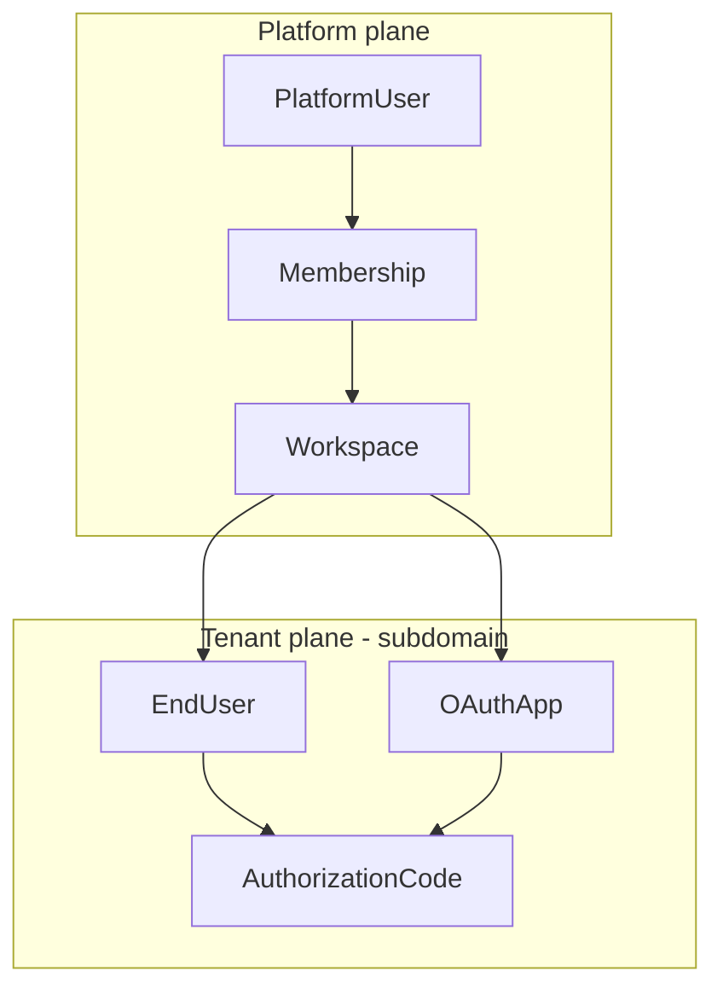

# Multi-tenant SaaS architecture (OneAuth)

Locked-in product decisions:

| # | Decision |
|---|----------|
| 1 | **Separate end users** from platform (dashboard) users |
| 2 | **Subdomains** for tenant resolution |
| 3 | **Billing after** core tenancy, invites, and RBAC |
| 4 | **Authorize branding:** workspace + app name first; logos/custom domains later |

Deployment modes: `personal` (today) and `saas` (hosted product).

---

## 1. Two user populations

Do **not** share one `User` collection for dashboard operators and consumer-app logins. Split identity cleanly.

### 1.1 Platform user (your customer’s employee)

Signs into **OneAuth dashboard** at `app.oneauth.com` (or root in personal mode).

| Field | Notes |
|-------|--------|
| Global unique `email` | Login for dashboard only |
| `passwordHash`, `isVerified` | Same as today |
| No `workspaceId` on user | Membership links user ↔ workspace |

**Collection:** `platform_users` (or keep name `User` only in personal mode; in SaaS rename conceptually to PlatformUser).

### 1.2 End user (your customer’s customer)

Signs in via **OAuth authorize** on tenant subdomain, e.g. `acme.oneauth.com/authorize`.

| Field | Notes |
|-------|--------|
| `workspaceId` | **Required** — tenant boundary |
| `email` | Unique per workspace: compound index `(workspaceId, email)` |
| `passwordHash`, `isVerified` | Same patterns as today |
| Optional `externalId` | Customer’s own user id on import/link |

**Collection:** `end_users`

Same human could exist as end users in workspace A and B with the same email — that is correct (different tenants).

### 1.3 Why separate tables

- No IDOR between “my app’s user” and “I manage OneAuth.”
- Per-tenant email uniqueness without global collisions.
- Clear JWT claims: `type: "platform"` vs `type: "end_user"`.
- Easier GDPR export/delete per workspace for consumer data only.



---

## 2. Subdomain tenancy

### 2.1 Host map

| Host | Purpose |
|------|---------|
| `oneauth.com` / `app.oneauth.com` | Marketing, dashboard, workspace admin APIs |
| `{slug}.oneauth.com` | Tenant plane: authorize, login, signup (end users), tenant-scoped OAuth token CORS |
| `api.oneauth.com` (optional) | Central OAuth token if you prefer single token URL |

**Recommendation (best approach):** Use **tenant subdomain for all end-user-facing auth UI and authorize**, and keep **dashboard on a fixed host** (`app.`). OAuth token exchange can live on tenant subdomain *or* centrally with `client_id` resolving workspace — central is simpler for SDK docs.

```txt
Dashboard:     https://app.oneauth.com/login
Authorize:     https://acme.oneauth.com/authorize?client_id=...
Token:         https://app.oneauth.com/api/oauth/token   (central, client_id → workspace)
               OR https://acme.oneauth.com/api/oauth/token (fully isolated; SDK uses authUrl per tenant)
```

**Best approach for SDK simplicity:** Central token URL on `app.`; tenant subdomain only for browser login/authorize. `NEXT_PUBLIC_AUTH_URL` for a consumer app becomes `https://acme.oneauth.com` (tenant-specific authorize), token POST still documented as `https://app.oneauth.com/api/oauth/token` with same `client_id`.

### 2.2 Resolving workspace from request

```ts
// middleware or lib/workspace/resolve.ts
function workspaceFromHost(host: string): string | null {
  // acme.oneauth.com → slug "acme"
  // app.oneauth.com → null (platform)
}
```

- Load `Workspace` by `slug` (unique, indexed).
- Invalid/disabled slug → 404 tenant not found.
- Attach `workspace` to request context for end-user routes only.

### 2.3 DNS & Vercel

- Wildcard domain: `*.oneauth.com` on Vercel project.
- `NEXT_PUBLIC_PLATFORM_URL=https://app.oneauth.com`
- `NEXT_PUBLIC_TENANT_DOMAIN=oneauth.com` (suffix for slug construction).
- Local dev: `acme.localhost:3000` via hosts file or `{slug}.localhost` pattern in middleware.

### 2.4 OAuth apps belong to workspace

`OAuthApp.workspaceId` + `slug` on workspace. `client_id` globally unique still works; resolver loads app → workspace for end-user login pages on correct subdomain (redirect if `client_id` opened on wrong slug).

---

## 3. Sessions & tokens

### 3.1 Platform session (dashboard)

- Refresh cookie domain: `.oneauth.com` or host-only `app.oneauth.com` (prefer **host-only** for security).
- Access JWT claims:

```json
{
  "type": "platform",
  "sub": "platformUserId",
  "email": "admin@customer.com",
  "workspace_id": "ws_abc",
  "role": "admin"
}
```

- Switching workspace → `POST /api/workspaces/:id/activate` re-issues access token; membership role from DB.

### 3.2 End-user session (tenant subdomain)

- Refresh cookie domain: `acme.oneauth.com` only (host-only) — **not** parent domain (prevents cross-tenant SSO bleed).
- “SSO” for end users = same tenant subdomain only: second app same workspace shares session if cookie domain matches tenant host.
- Access JWT for OAuth clients:

```json
{
  "type": "end_user",
  "sub": "endUserId",
  "email": "user@example.com",
  "workspace_id": "ws_abc",
  "client_id": "oa_xxx",
  "aud": "oa_xxx"
}
```

### 3.3 Authorization codes

`AuthorizationCode` stores `endUserId`, `workspaceId`, `clientId` (denormalized). PKCE unchanged.

---

## 4. Authorize UX (decision 4 — best approach)

**Phase SaaS-1–3 (ship first):**

- Show **workspace display name** + **app name** on `/authorize`.
- Show redirect URI hostname (truncated) + client type (public/confidential).
- Link: “Manage your account” → tenant subdomain `/account` (end-user account, not platform).

**Phase SaaS-5 (later):**

- Per-workspace `logoUrl`, `primaryColor` in `Workspace.settings`.
- Optional custom domain: `auth.customer.com` CNAME → Vercel (enterprise).

Do **not** block tenancy work on logo upload. Text branding is enough for trust.

---

## 5. Data model summary

### Workspace

```ts
{
  slug: string;          // unique, DNS-safe
  name: string;
  plan: "free" | "pro";  // billing later; default free
  status: "active" | "suspended";
  settings: { logoUrl?, primaryColor?, allowedEmailDomains? };
}
```

### Membership

```ts
{
  workspaceId: ObjectId;
  platformUserId: ObjectId;
  role: "owner" | "admin" | "developer" | "viewer";
}
```

### EndUser

```ts
{
  workspaceId: ObjectId;
  email: string;         // unique with workspaceId
  passwordHash: string;
  isVerified: boolean;
}
```

### OAuthApp

```ts
{
  workspaceId: ObjectId;
  createdByPlatformUserId: ObjectId;
  name, clientId, clientSecretHash, redirectUrls, clientType;
}
```

### AuditLog

```ts
{
  plane: "platform" | "tenant";
  workspaceId?: ObjectId;
  platformUserId?: ObjectId;
  endUserId?: ObjectId;
  action, ip, success, meta, expiresAt;
}
```

---

## 6. API layout

### Platform host (`app.oneauth.com`)

| Route | Auth |
|-------|------|
| `POST /api/auth/signup` | Creates PlatformUser + Workspace + Membership(owner) |
| `POST /api/auth/login` | Platform only |
| `GET/POST /api/workspaces` | Platform JWT |
| `GET/POST /api/workspaces/[id]/members` | Platform JWT + RBAC |
| `GET/POST /api/apps` | Scoped to `workspace_id` in JWT |
| `POST /api/workspaces/[id]/activate` | Sets active workspace on token |

### Tenant host (`{slug}.oneauth.com`)

| Route | Auth |
|-------|------|
| `POST /api/auth/signup` | Creates **EndUser** in resolved workspace |
| `POST /api/auth/login` | End user; sets tenant cookie |
| `GET /authorize` | End-user session + OAuth |
| `GET/POST /api/account/*` | End-user profile, sessions (tenant scoped) |

### Central (platform or tenant — pick one token URL)

| Route | Notes |
|-------|------|
| `POST /api/oauth/token` | Validates `client_id` → app → workspace; issues end-user JWT |

---

## 7. Phased roadmap (billing after)

### Phase 0 — Doc + flags

- `DEPLOYMENT_MODE=personal|saas`
- `features.multiTenant`, `features.tenantSubdomains`
- Middleware host parser stub

### Phase 1 — Foundation

- Models: `Workspace`, `Membership`, `EndUser`
- Migrate: existing `User` → `PlatformUser`; no end users yet
- `App.workspaceId` + backfill default workspace per platform user
- Subdomain middleware + workspace by slug
- Split signup: platform on `app.`, end-user signup on tenant host (can ship after Phase 1b)

### Phase 2 — Tenant auth plane

- End-user login/signup/refresh/logout on `{slug}.`
- Authorize uses `EndUser` + tenant cookies
- OAuth codes + tokens reference `endUserId`
- Wrong-subdomain guard for `client_id`

### Phase 3 — Team & RBAC (implemented)

- Invites (email), roles, member APIs on platform host
- `GET/POST /api/workspaces/[id]/invites`, `DELETE .../invites/[inviteId]`
- `GET/PATCH/DELETE /api/workspaces/[id]/members/[userId]`
- `GET /api/invites/preview?token=`, `POST /api/invites/accept`
- UI: `/workspace/members`, `/invite/accept`, header **Team** link
- Audit actions: `workspace.invite.*`, `workspace.member.*`
- Audit `plane` + `workspaceId` on events; per-tenant rate limit keys; RBAC on audit/sessions APIs — Done

### Phase 4 — Billing (deferred)

- Stripe, plans, MAU/app limits enforcement
- Usage from audit aggregates

### Phase 5 — Polish

- Workspace branding on authorize
- Custom domains
- OIDC issuer per workspace (`https://acme.oneauth.com/.well-known/...`)

---

## 8. Personal mode compatibility

`DEPLOYMENT_MODE=personal`:

- No subdomains required; optional `localhost` only.
- Single implicit workspace; platform user only; end users can still use separate table with one workspace id for code-path unity.
- Or: personal mode keeps legacy single `User` until SaaS flag on — **best approach:** one code path, always `EndUser` + default workspace, avoids dual logic.

---

## 9. Security checklist (subdomain + split users)

- [ ] Compound unique `(workspaceId, email)` on end users
- [ ] Cookie `Domain` never `.oneauth.com` for end-user refresh
- [ ] Every `appId` lookup checks `app.workspaceId === resolvedWorkspace.id`
- [ ] Platform JWT rejected on tenant-only routes and vice versa
- [ ] Invite tokens hashed; scoped to `workspaceId`
- [ ] Rate limit: `workspaceId:ip` on tenant routes
- [ ] CORS on token: app redirect origins + workspace slug validation

---

## 10. Config additions (preview)

```ts
// oneauth.config.ts (saas)
deployment: {
  mode: "personal" | "saas",
  platformHost: "app.oneauth.com",
  tenantDomainSuffix: "oneauth.com",
},
features: {
  multiTenant: true,
  tenantSubdomains: true,
},
```

```env
DEPLOYMENT_MODE=saas
NEXT_PUBLIC_PLATFORM_URL=https://app.oneauth.com
TENANT_DOMAIN_SUFFIX=oneauth.com
```

---

## 11. Implementation order (recommended)

1. `Workspace` + `Membership` + platform user rename/migration  
2. `EndUser` + tenant subdomain middleware  
3. End-user auth routes on tenant host  
4. OAuth pipeline switched to `EndUser`  
5. Dashboard workspace switcher + RBAC + invites  
6. Billing  

**Next build step:** Phase 1 + 2 together (foundation + tenant auth plane) so authorize works on `acme.` with real end users.

---

## Implementation status (in repo)

| Item | Status |
|------|--------|
| `Workspace`, `Membership`, `EndUser` models | Done |
| `App.workspaceId` + backfill on signup/migrate | Done |
| Subdomain middleware (`x-oneauth-plane`, slug headers) | Done |
| Platform vs tenant login/signup (`plane-auth`) | Done |
| OAuth → `EndUser` when `MULTI_TENANT_ENABLED=true` | Done |
| JWT `type`, `workspace_id`, `role` on platform tokens | Done |
| `/api/workspaces`, `/activate`, `/migrate` | Done |
| Workspace switcher (apps/account header) | Done |
| Authorize shows workspace + app name | Done |
| Invites / team RBAC | Done (invite email, accept flow, members UI, audit events) |
| SaaS dashboard (`/dashboard`) | Done |
| Workspace onboarding (`/workspace/new`, subdomain picker) | Done |
| RBAC on audit/sessions routes | Done |
| SaaS E2E demo guide (`docs/SAAS-E2E.md`) | Done |
| Billing | Not started |

### Enable SaaS locally

```env
DEPLOYMENT_MODE=saas
MULTI_TENANT_ENABLED=true
NEXT_PUBLIC_PLATFORM_URL=http://localhost:3000
TENANT_DOMAIN_SUFFIX=localhost:3000
```

Use tenant URLs like `http://acme.localhost:3000` (add hosts entry or local DNS). Register apps on platform host; end users authorize on tenant subdomain.

After upgrading an existing DB, call `POST /api/workspaces/migrate` once while logged in (creates default workspace + backfills apps).

**Personal mode (default):** `multiTenant: false` — behavior matches pre-SaaS; workspace backfill still runs invisibly for forward compatibility.

---

## 12. Open questions (minor)

- **Slug change policy:** immutable after create vs redirect old slug.
- **Cross-tenant end-user email:** allowed (same email, two workspaces) — yes, by design.
- **Platform user also an end user:** same email in two tables allowed; link not required.
